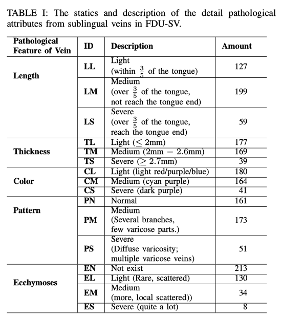
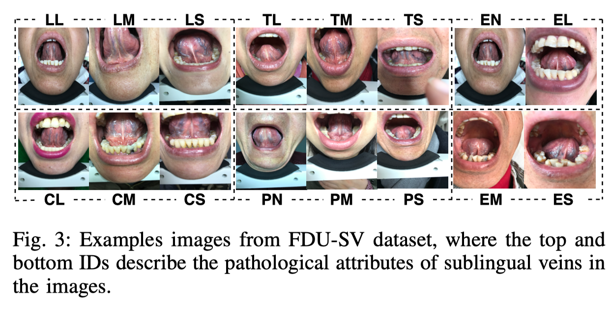

# FDU-SV (sublingual-vein-dataset)

We construct a high-resolution sublingual vein segmentation dataset (FDU-SV) collected from 385 male and female patients suffering from different diseases and manually annotated by tongue and sublingual vein segmentations with detail attributes such as width and thickness. All images are captured by a contactless imaging device with a size of 3024×4072, and the ages of different subjects vary from 25 to 83. Note that we have obtained the agreement from the patients before releasing the dataset of their front mouth images, thus FDU-SV would not reveal their identities.

# Code

Our paper has been accepted by **BIBM 2020** as regular paper. 

# Cite

If you use the code or find it helpful, please cite the following paper:

```
 @inproceedings{xiong2020multiscale, 
 title={Multi-scale Generative Adversarial Network for Automatic Sublingual Vein Segmentation}, author={Xiong, Qingyue and Li, Xinlei and Yang, Dawei and Zhang, Wei and Zhang, Ye and Kong, Yajie and Li, Fufeng and Zhang, Wenqiang},
booktitle={2020 IEEE International Conference on Bioinformatics and Biomedicine (BIBM)}, year={2020}, organization={IEEE} }
```

# Dataset Details

- 




TABLE I presents the attributes of sublingual veins with various clinical labels, indicating the strong diversity of FDU-SV. Under the guidance of experienced TCM doctors, we divide the sublingual veins into five major categories by their pathological features, each of which is detailed into about 3 to 4 subcategories. TABLE I gives detailed information about the FDU-SV dataset with the pathological categories of sublingual veins, the description of different IDs, and their amount. Note that for a single sublingual vein, it may be divided into multiple categories but only one subcategory in each category. Fig 3 shows several images from FDU-SV. Besides, as shown in Fig 1, the tongue in images is also annotated although we only focus on sublingual segmentation in this paper. In the future, we are going to study an end-to-end TCM remote diagnosis system based on the well-annotated FDU-SV dataset.

# Terms & Conditions

The dataset is available for non-commercial research purposes only.

You agree not to reproduce, duplicate, copy, sell, trade, resell or exploit for any commercial purposes, any portion of the images and any portion of derived data.

# How to get the Dataset

Updating

# Contact Authors

Qingyue Xiong, e-mail: qyxiong19@fudan.edu.cn

Xinlei Li ,e-mail: 18110860019@fudan.edu.cn


